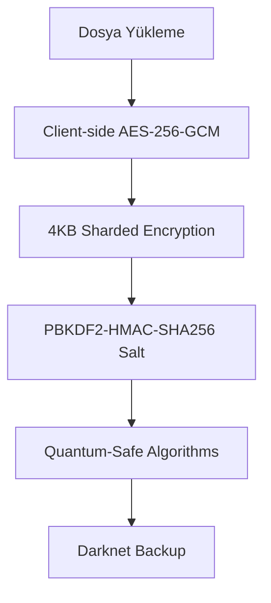

# 🔒 HARDLOCK - Gelişmiş Dosya Güvenlik Platformu

<div align="center">


**Finansal Sektör Standartlarında Güvenlik • Mikroservis Tabanlı • Quantum-Safe Encryption**

[](https://www.docker.com/)
[](https://dotnet.microsoft.com/)
[](https://reactjs.org/)
[](LICENSE)

[🚀 Hızlı Başlangıç](#-hızlı-başlangıç) • [🏗️ Mimari](#️-mimari) • [🛡️ Güvenlik](#️-güvenlik) • [📊 Demo](#-demo)

</div>

---

## 📋 Proje Özeti

HARDLOCK, **finansal sektör standartlarında güvenlik** sağlayan, mikroservis tabanlı gelişmiş dosya şifreleme ve depolama platformudur. Kullanıcıların dosyalarını güvenli bir şekilde şifreleyip saklamalarını, coğrafi kısıtlamalar uygulamalarını ve hatta **darknet üzerinde yedekleme** yapmalarını sağlar.

### 🌟 **Öne Çıkan Özellikler**

- 🔐 **Dual-Layer Encryption** - Dosya + Depolama seviyesinde şifreleme
- 🌍 **Geographic Locking** - Konum tabanlı erişim kontrolü
- ⚡ **Quantum-Safe Algorithms** - Post-quantum kriptografi
- 🕸️ **Darknet Backup** - Tor ağı üzerinde dağıtık depolama
- 💥 **Self-Destruct Mechanism** - Başarısız giriş denemelerinde otomatik imha
- 🧬 **Biometric Authentication** - FIDO2 entegrasyonu
- 🎯 **Honey Pot Files** - Saldırı tespiti ve önleme
- ⏰ **Timelock Decryption** - Zaman tabanlı erişim kontrolü

---

## 🏗️ Mimari

### 🔧 **Core Services**

| Service | Port | Açıklama | Durum |
|---------|------|----------|-------|
| **Identity Service** | 5001 | JWT Authentication & Authorization | ✅ Tamamlandı |
| **Encryption Service** | 5002 | Client-side AES-256-GCM encryption | ✅ Tamamlandı |
| **Storage Service** | 5003 | S3/Blob storage with cold wallet backup | ✅ Tamamlandı |
| **Access Control Service** | 5004 | Multi-user access management | ✅ Tamamlandı |
| **Audit Service** | 5005 | Comprehensive audit logging | ✅ Tamamlandı |
| **Notification Service** | 5006 | Real-time alerts and notifications | ✅ Tamamlandı |
| **API Gateway** | 8080 | Reverse proxy and routing | ✅ Tamamlandı |
| **Frontend** | 3000 | React-based user interface | ✅ Tamamlandı |

### 📊 **Monitoring & Observability**

- **Prometheus** (9090) - Metrik toplama ve analiz
- **Grafana** (3001) - Gerçek zamanlı dashboard'lar
- **ELK Stack** - Log toplama ve analiz
- **Jaeger** - Distributed tracing

---

## 🚀 Hızlı Başlangıç

### 📋 **Gereksinimler**

- ✅ Docker & Docker Compose
- ✅ .NET 8 SDK (geliştirme için)
- ✅ En az 4GB RAM
- ✅ 10GB boş disk alanı

### ⚡ **Tek Komutla Kurulum**

```bash
# Repository'yi klonlayın
git clone https://github.com/Furkan1287/hardlock.git
cd hardlock

# Tüm servisleri başlatın
docker-compose up -d

# Servislerin durumunu kontrol edin
docker-compose ps
```

### 🌐 **Erişim URL'leri**

| Servis | URL | Açıklama |
|--------|-----|----------|
| **Frontend** | http://localhost:3000 | React uygulaması |
| **API Gateway** | http://localhost:8080 | Ana API endpoint |
| **Swagger Docs** | http://localhost:8080/swagger | API dokümantasyonu |
| **Grafana** | http://localhost:3001 | Monitoring dashboard |
| **Prometheus** | http://localhost:9090 | Metrik toplama |

### 🔐 **Varsayılan Kullanıcı**

- **Email**: `admin@hardlock.com`
- **Şifre**: `Admin123!`

---

## 🛡️ Güvenlik Özellikleri

### 🔐 **Dosya Şifreleme**



- **Client-side şifreleme** - AES-256-GCM ile
- **Sharded encryption** - Dosyalar 4KB parçalara bölünür
- **Benzersiz salt** - PBKDF2-HMAC-SHA256 anahtar türetme
- **Quantum-safe** - CRYSTALS-Kyber & CRYSTALS-Dilithium

### 🌍 **Erişim Kontrolü**

- **Çok faktörlü kimlik doğrulama** - FIDO2 entegrasyonu
- **Coğrafi kısıtlama** - GPS tabanlı erişim kontrolü
- **Yakınlık doğrulaması** - BLE tabanlı cihaz doğrulama
- **Davranış analizi** - AI destekli anomali tespiti

### 💾 **Yedekleme & Kurtarma**

- **Soğuk cüzdan depolama** - AWS Glacier değiştirilemez yedekleme
- **Darknet yedekleme** - Tor ağı üzerinde IPFS ile dağıtık depolama
- **Cross-region replication** - Felaket kurtarma
- **WORM compliance** - Write Once Read Many
- **Distributed Hash Table** - P2P dosya keşfi

---

## 🛠️ Geliştirme Ortamı

### 📦 **Kurulum Adımları**

1. **Repository'yi klonlayın:**
   ```bash
   git clone https://github.com/Furkan1287/hardlock.git
   cd hardlock
   ```

2. **Docker Compose ile başlatın:**
   ```bash
   docker-compose up -d
   ```

3. **Servislerin durumunu kontrol edin:**
   ```bash
   docker-compose ps
   ```

4. **Logları kontrol edin:**
   ```bash
   docker-compose logs -f [service-name]
   ```

### 🔧 **Geliştirme İçin Gereksinimler**

- **Backend**: .NET 8 SDK
- **Frontend**: Node.js 18+
- **Container**: Docker & Docker Compose
- **Version Control**: Git

### 🗄️ **Veritabanı**

- **Geliştirme**: SQLite (otomatik kurulum)
- **Production**: PostgreSQL 15+ (planlanıyor)

### 🔧 **Diğer Servisler**

- **Redis 7+** - Cache ve session yönetimi
- **Hashicorp Vault** - Anahtar yönetimi
- **Tor Browser** - Darknet erişimi testi
- **IPFS** - Dağıtık dosya depolama

---

## 🔧 Konfigürasyon

### ⚙️ **Environment Variables**

```env
# Veritabanı (Geliştirme)
DATABASE_CONNECTION_STRING=Data Source=hardlock.db

# JWT Konfigürasyonu
JWT__Secret=your-super-secret-key-here
JWT__Issuer=hardlock
JWT__Audience=hardlock-users
JWT__ExpiryMinutes=15

# Depolama (Production için)
AWS_S3_BUCKET=hardlock-files
AWS_GLACIER_VAULT=hardlock-backup

# Güvenlik
MAX_LOGIN_ATTEMPTS=3
SELF_DESTRUCT_ENABLED=true
```

### 🐳 **Docker Compose Yapısı**

```yaml
services:
  identity-service:     # JWT Authentication
  encryption-service:   # File Encryption
  storage-service:      # File Storage
  access-control:       # Access Management
  audit-service:        # Audit Logging
  notification-service: # Notifications
  gateway:              # API Gateway
  frontend:             # React UI
  prometheus:           # Metrics
  grafana:              # Dashboards
```

---

## 🐛 Sorun Giderme

### ❗ **Yaygın Sorunlar ve Çözümleri**

#### 1. **Port Çakışması**
```bash
# Kullanılan portları kontrol edin
lsof -i :3000
lsof -i :8080

# Servisleri durdurun ve yeniden başlatın
docker-compose down
docker-compose up -d
```

#### 2. **JWT Secret Hatası**
- `appsettings.json` dosyasının doğru konumda olduğundan emin olun
- Environment değişkenlerinin doğru ayarlandığını kontrol edin

#### 3. **Frontend Bağlantı Sorunu**
```bash
# Frontend container'ını yeniden başlatın
docker-compose restart frontend

# Logları kontrol edin
docker-compose logs frontend
```

#### 4. **Build Hataları**
```bash
# Cache'i temizleyin ve yeniden build edin
docker-compose down -v
docker-compose build --no-cache
docker-compose up -d
```

---

## 📊 Demo

### 🎯 **Özellik Gösterimi**

1. **Dosya Yükleme ve Şifreleme**
   - Client-side AES-256-GCM şifreleme
   - 4KB sharded encryption
   - Quantum-safe algoritmalar

2. **Erişim Kontrolü**
   - JWT tabanlı authentication
   - Role-based access control
   - Multi-user management

3. **Monitoring ve Audit**
   - Real-time metrics
   - Comprehensive audit logging
   - Grafana dashboard'ları

4. **API Dokümantasyonu**
   - Swagger UI entegrasyonu
   - Interactive API testing
   - Complete endpoint documentation

---

## 🔮 Gelecek Planları

### ✅ **Tamamlanan Servisler**

- [x] **Identity Service** - JWT Authentication & Authorization
- [x] **Storage Service** - S3/Blob storage implementation
- [x] **Access Control Service** - Multi-user access management
- [x] **Audit Service** - Comprehensive audit logging
- [x] **Notification Service** - Real-time alerts and notifications
- [x] **Encryption Service** - Client-side encryption
- [x] **API Gateway** - Reverse proxy and routing
- [x] **Frontend** - React-based user interface
- [x] **Docker Compose** - Complete containerization
- [x] **Monitoring** - Prometheus + Grafana setup

### 🚧 **Geliştirilme Aşamasında**

- [ ] **Cold Wallet Service** - Immutable backup implementation
- [ ] **Frontend UI/UX** - Enhanced user interface
- [ ] **API Documentation** - Complete endpoint documentation

### 🎯 **Planlanan Özellikler**

- [ ] **FIDO2 Biometric** - Biometric authentication
- [ ] **Quantum-Safe Encryption** - Post-quantum cryptography
- [ ] **AI Anomaly Detection** - Machine learning security
- [ ] **BLE Proximity** - Bluetooth proximity verification
- [ ] **Cross-Region Replication** - Disaster recovery
- [ ] **WORM Compliance** - Write Once Read Many
- [ ] **Darknet Backup** - Tor network implementation
- [ ] **Geographic Locking** - Location-based access
- [ ] **Self-Destruct Mechanism** - Auto-destruct functionality

### 📈 **Production Hazırlığı**

- [ ] **PostgreSQL Migration** - Production database
- [ ] **Performance Optimization** - Load testing and tuning
- [ ] **Security Audit** - Penetration testing
- [ ] **Load Testing** - Stress testing
- [ ] **Documentation Completion** - Full documentation
- [ ] **CI/CD Pipeline** - Automated deployment
- [ ] **Kubernetes Deployment** - Container orchestration

---

## 🤝 Katkıda Bulunma

HARDLOCK'a katkıda bulunmak istiyorsanız:

1. **Repository'yi fork edin**
2. **Feature branch oluşturun** (`git checkout -b feature/amazing-feature`)
3. **Değişiklikleri commit edin** (`git commit -m 'Add amazing feature'`)
4. **Branch'e push edin** (`git push origin feature/amazing-feature`)
5. **Pull Request oluşturun**

### 📋 **Katkı Rehberi**

- Kod standartlarına uyun
- Test yazın
- Dokümantasyonu güncelleyin
- Security best practices'i takip edin

---

## 🆘 Destek

### 📞 **İletişim**

- 📧 **Email**: support@hardlock.com
- 💬 **Discord**: [HARDLOCK Community](https://discord.gg/hardlock)
- 📖 **Dokümantasyon**: [docs.hardlock.com](https://docs.hardlock.com)
- 🐛 **Issues**: [GitHub Issues](https://github.com/Furkan1287/hardlock/issues)

### 📚 **Kaynaklar**

- [API Dokümantasyonu](http://localhost:8080/swagger)
- [Grafana Dashboard](http://localhost:3001)
- [Prometheus Metrics](http://localhost:9090)

---

## 📝 Lisans

Bu proje MIT License altında lisanslanmıştır. Detaylar için [LICENSE](LICENSE) dosyasına bakın.

---

<div align="center">

**HARDLOCK** - Gelişmiş Dosya Güvenlik Platformu

[](https://github.com/Furkan1287/hardlock/stargazers)
[](https://github.com/Furkan1287/hardlock/network)
[](https://github.com/Furkan1287/hardlock/issues)

*Finansal sektör standartlarında güvenlik, modern teknolojilerle*

</div> 